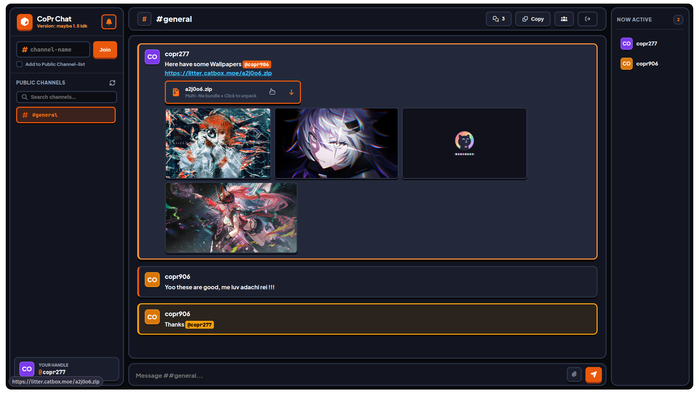
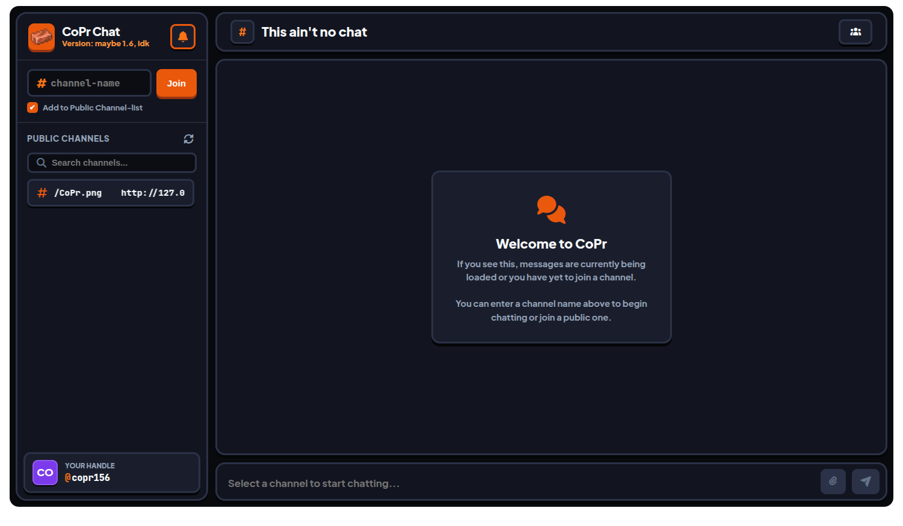

> # Chat platform running on [https://countapi.mileshilliard.com](countapi.mileshilliard.com)
- **Protocol: [countProtocol.js](./js/protocol/countProtocol.js)**

## Disclaimers:
| Area                | Description                                                                                 |
| :------------------ | :------------------------------------------------------------------------------------------ |
| **Moderation**      | Completely unmoderated. Content is delivered without filtering or censorship.               |
| **Channel Control** | Any user can clear chat history, reset messages, or delete a room at any time.              |
| **File Storage**    | Uploads use Catbox Litterbox with 24-hour expiration. Strictly no illegal content.          |
| **Backend**         | Runs via `countapi.mileshilliard.com`. Payloads are obfuscated as scrambled number strings. |
| **Audio**           | Utilizes the Web Audio API for message and mention sound effects.                           |
| **Notifications**   | Requests system notification permissions for mentions if supported by your browser.         |

## Previews:

## Others:
### I should be under the Rate-Limit of the API: https://github.com/syntaxerror019/countapi/blob/main/api/index.py#L151 -> maximum 10req/s
- ### I am making one request per 333ms, which is 3req/s, so it should be fine